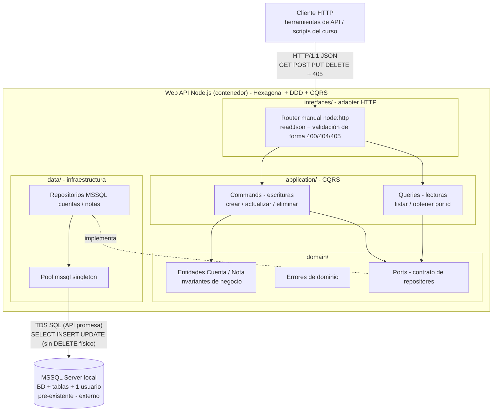
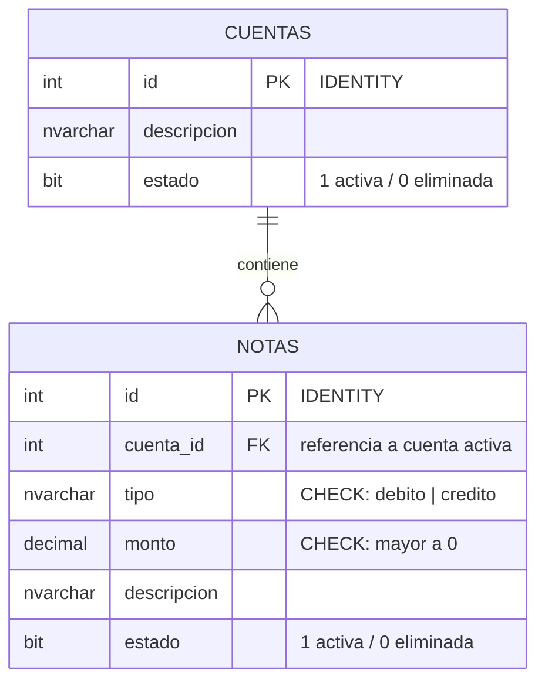

# Arquitectura del Sistema - GPS Principal

Este documento sirve como **GPS arquitectónico** para orientar decisiones de diseño y desarrollo en el ecosistema.

## Resumen Ejecutivo

### Propósito y alcance del sistema

Web API de gestión de cuentas financieras y notas débito/crédito (CRUD) que persiste en MSSQL Server local. Es una **prueba de concepto de un curso de Node.js**: validar HTTP nativo, validación de requests y persistencia. Sin usuarios, roles, autenticación ni tokenización.

### Dominios y repositorios críticos

- **Dominios/módulos críticos**: `src/` de la Web API (único módulo en desarrollo), organizado en capas hexagonales: `interfaces` / `application` (CQRS) / `domain` / `data` (repositorios).
- **Repositorios críticos**: este workspace (`cuentas-webapi`); el repo git vive un nivel arriba.
- **Límites del sistema**: incluye solo la API y su integración de datos. **No incluye**: provisión de la BD, tablas ni usuario de conexión (prerrequisito manual externo), UI, auth, pruebas automatizadas, logs/observabilidad.

## Arquitectura de Alto Nivel

### Diagrama principal del ecosistema



**Lectura**: un solo contenedor propio (la API) entre dos sistemas externos: el cliente HTTP y MSSQL local. Cada request fluye: adapter HTTP → use case (command o query) → entidades/invariantes del dominio → puerto de repositores → repositorio MSSQL → SQL. El dominio **no conoce HTTP ni `mssql`**; la inversión de dependencias se resuelve con inyección manual en el composition root (`index.js`). El pool de conexión es singleton a nivel de proceso. La eliminación es lógica (`UPDATE estado`); nunca se ejecuta `DELETE` sobre los datos.

### Modelo de datos y prerrequisito DDL



DDL de referencia para el **prerrequisito manual** (la API no provisiona la BD):

```sql
CREATE TABLE cuentas (
    id          INT IDENTITY(1,1) PRIMARY KEY,
    descripcion NVARCHAR(200) NOT NULL,
    estado      BIT NOT NULL DEFAULT(1)
);

CREATE TABLE notas (
    id          INT IDENTITY(1,1) PRIMARY KEY,
    cuenta_id   INT NOT NULL REFERENCES cuentas(id),
    tipo        NVARCHAR(10) NOT NULL CONSTRAINT chk_nota_tipo CHECK (tipo IN ('debito','credito')),
    monto       DECIMAL(18,2) NOT NULL CONSTRAINT chk_nota_monto CHECK (monto > 0),
    descripcion NVARCHAR(200) NOT NULL,
    estado      BIT NOT NULL DEFAULT(1)
);
```

## Stack y Patrones Clave

### Tecnologías que condicionan arquitectura

- **Runtime**: Node.js ≥ 24 (base `^24.21`; máquina local validada: v24.21.0).
- **Protocolo**: módulo nativo `node:http` — **sin frameworks** (restricción del curso).
- **Módulos**: ESM — `package.json` con `"type": "module"`, código en `.js` ESM (decisiones D1/D2).
- **Persistencia**: driver `mssql` (v12.x; API promesa nativa, se consume con `await`, sin callbacks ni `util.promisify`).
- **Plataforma**: proceso único local (Windows), sin contenedores ni cloud.

### Patrones arquitectónicos relevantes

- **Hexagonal (ports & adapters) + DDD ligero** (requisito PO): 4 capas — `interfaces/` (adapter HTTP), `application/` (use cases CQRS + puertos), `domain/` (entidades, invariantes, errores de dominio), `data/` (pool + repositorios MSSQL). Las dependencias apuntan al interior: `domain` no importa nada del proyecto; `application` solo conoce `domain`; `data` e `interfaces` son adaptadores intercambiables.
- **CQRS mínimo**: separación por recurso entre *commands* (escribir: `CrearCuenta`, `ActualizarCuenta`, `EliminarCuenta`; futuro `...Nota`) y *queries* (leer: `ListarCuentas`, `ObtenerCuentaPorId`). Cada use case es una función `async` que recibe su repositores por inyección manual (DI en el composition root); sin bus de eventos ni sagas (PoC).
- **Puertos & adapters**: el contrato de repositores (interfaz) se define en `application/.../ports.js`; la implementación sobre `mssql` vive en `data/`. El composition root (`index.js`) ensambla: pool → repositores → use cases → adapter HTTP.
- **Router manual + `readJson(req)`** en `interfaces/http/`: match de método + ruta sobre `req.url`/`req.method`; `405` con header `Allow` si la ruta existe con otros métodos, `404` si no existe; el helper promesa valida `Content-Type: application/json` y JSON válido → `400` en ambos fallos.
- **Errores de dominio → HTTP**: el dominio lanza errores tipados (`CuentaNoEncontradaError`, `CampoInvalidoError`, ...); el adapter los traduce a `400` (validación), `404` (no encontrado/eliminado lógicamente), `405` (método) y `500` (imprevisto) — siempre JSON `{ "error": "..." }`.
- **Pool singleton** en `data/connection.js`: un `mssql.ConnectionPool` por proceso; `connect()` al arrancar y `close()` en `SIGTERM`.
- **Respuestas**: creación `201` + id generado (IDENTITY, `result.inserted`); eliminación lógica `204 No Content`.

## Integraciones Críticas

### Integraciones internas y externas de mayor impacto

| Integración | Participantes | Canal/protocolo | Criticidad |
|---|---|---|---|
| Consumo de la API | Cliente HTTP (herramientas/scripts) ↔ Web API | HTTP/1.1 + JSON | Alto (interfaz principal) |
| Persistencia | Web API ↔ MSSQL Server local | TDS SQL vía driver `mssql` (pool, API promesa) | Alto (fuente de verdad) |

**Flujos críticos**: `POST /cuentas` → adapter → command `CrearCuenta` → `CuentaRepository.insert` → `201` con id · `POST /notas` → command `CrearNota` verifica cuenta activa vía query/repo (`404` si no existe) → INSERT → `201` · eliminación lógica → command `UPDATE estado = 0` → `204`.

**Contrato de errores**: `400` body/campos inválidos · `404` recurso no existe **o fue eliminado lógicamente** · `405` método no soportado en la ruta · `500` fallo de BD/imprevisto (siempre JSON).

### Seguridad de integración (Auth/Authz)

- **Autenticación**: ninguna (decisión PO: PoC sin usuarios ni tokens).
- **Autorización**: ninguna.
- **Controles críticos**: la única credencial del sistema es el usuario SQL de la BD, provisto por variables de entorno — nunca en código ni commit (ver D4).

## Dependencias Externas Estratégicas

### Servicios y terceros que condicionan la solución

- **MSSQL Server local** (localhost:1433, BD + tablas `cuentas`/`notas` + 1 usuario): pre-existente, creado **manualmente** antes de ejecutar la API.
  - **Dependencia operativa**: si no está disponible al arrancar, la API no debe servir tráfico (fallo rápido con `500` JSON o error de arranque claro); su esquema es requisito del DDL de referencia.
- **`mssql` (npm, v12.x)**: única dependencia de runtime del proyecto.
- **Cliente HTTP**: cualquier consumidor (p. ej. extensión `.http` de VS Code); sin acoplamientos.

## Decisiones de Arquitectura (registro)

| # | Decisión | Justificación |
|---|---|---|
| D1 | ESM: `"type": "module"` + archivos `.js` | NFR pide ESM; evita mezclar `.mjs`/`.js` en un solo proyecto |
| D2 | `package.json`: `mssql ^12` en dependencies, `engines: node ^24.21`, `dev` corregido a `node --watch src/index.js` | package.json actual: `type=commonjs`, sin deps, sin engines, script `dev` auto-referencial (bucle) |
| D3 | Estructura hexagonal `src/`: `index.js` (composition root + server), `interfaces/http/` (router, `readJson`, adapters por recurso), `application/{cuentas,notas}/` (commands, queries, ports), `domain/` (entidades `cuenta.js`/`nota.js`, errores, invariantes), `data/` (pool `connection.js` + repositorios MSSQL) | Requisito PO: DDD + hexagonal + CQRS mínimo con capas aplicación/dominio/datos; separación por recurso mantiene cada historia autocontenida (1.1 = cuentas, 1.2 = notas) |
| D4 | Conexión BD por env: `MSSQL_USER`, `MSSQL_PASS` (o `MSSQL_CONNECTION` completa) con default a localhost:1433 | Un único usuario de conexión (PO); credenciales fuera del código |
| D5 | Eliminación vía `DELETE /cuentas/{id}` y `DELETE /notas/{id}` → `204 No Content`; operación = `UPDATE estado` | La historia deja el método abierto (acepta 200/204); `DELETE` expresa la semántica REST y `204` su respuesta canónica |
| D6 | IDs `INT IDENTITY` generados por BD; `POST` responde `201` con el id | El id es opaco al cliente (NFR: cuenta mínima = id + descripción) |
| D7 | `405` solo para método no soportado **en ruta existente** (header `Allow`); `404` para rutas inexistentes | Semántica HTTP estándar, exigida por AC 6 de 1.1 / AC 5 de 1.2 |
| D8 | DDL con `CHECK` (tipo, monto > 0) y FK `notas.cuenta_id → cuentas.id` sin `ON DELETE` | Refuerza en BD las reglas de negocio; la eliminación lógica impide cascade |
| D9 | `pool.connect()` en arranque, `close()` en `SIGTERM`, error `500` JSON ante fallo de BD | Fallo rápido y observable en PoC sin logging formal |
| D10 | CQRS mínimo: commands (escribir) / queries (leer) por recurso; DI manual en el composition root, sin frameworks ni bus de eventos | Cumple el requisito PO de CQRS sin complejizar la PoC; el dominio permanece libre de HTTP y del driver |
| D11 | Invariantes de negocio en el dominio (descripción no vacía; tipo ∈ {debito,credito}; monto > 0); el adapter valida solo la forma del input (Content-Type, JSON, tipos primitivos → `400`) | Reglas de negocio en un solo lugar; el adapter traduce errores de dominio a códigos HTTP (D7) |

## Referencias Base

### Documentación analizada y fuentes clave

- `docs/stories/1-gestion-cuentas-financieras/` (historia padre, 9 escenarios GWT, reglas de negocio)
- `docs/stories/1.1-crud-cuentas-financieras/` (slice 1 — primera en implementar) y `docs/stories/1.2-crud-notas-debito-credito/` (slice 2)
- `handoff.md` (estado PO: Ready for Testing; prerrequisitos de implementación)
- `package.json`, `src/index.js` (esqueleto vacío — validado contra código)

---

**Este GPS es una vista arquitectónica ejecutiva para orientar decisiones y priorizar evolución del sistema.**

---

> **Método Ceiba documentar-arquitectura-base** v n/d | Modelo: miia | Usuario: Gerson Sanchez | Fecha: 2026-09-24
